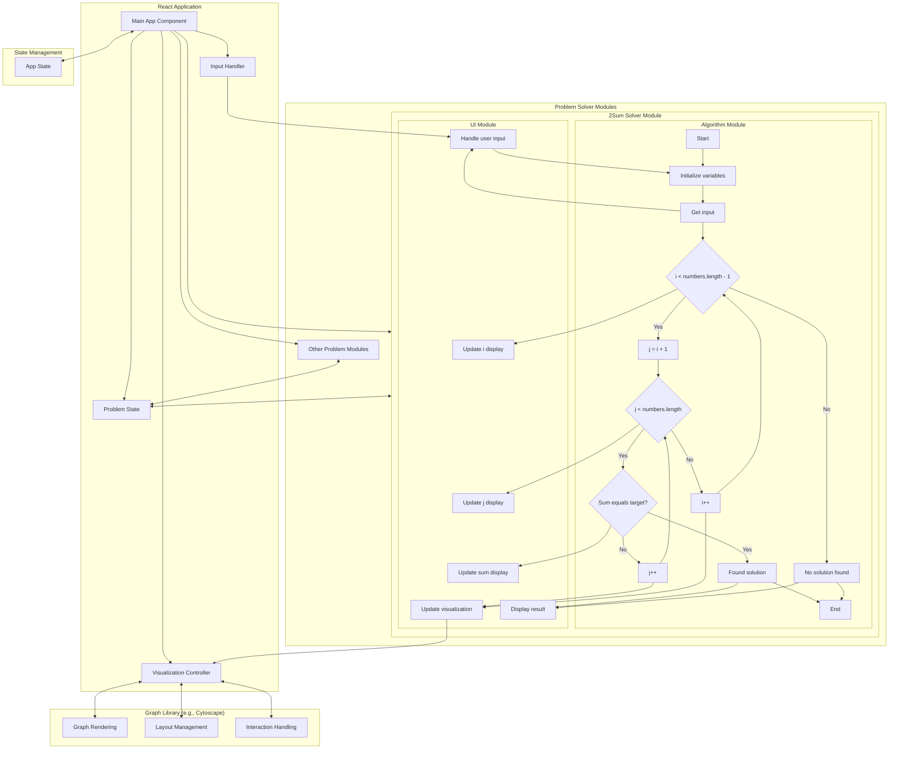

```mermaid

graph TD
    subgraph ReactApp["React Application"]
        MAIN[Main App Component]
        PS[Problem Selection]
        IH[Input Handler]
        VC[Visualization Controller]
    end

    subgraph GraphLibrary["Graph Library (e.g., Cytoscape)"]
        GR[Graph Rendering]
        LM[Layout Management]
        INT[Interaction Handling]
    end

    subgraph ProblemSolverModules["Problem Solver Modules"]
        subgraph TwoSumModule["2Sum Solver Module"]
            subgraph AlgorithmModule["Algorithm Module"]
                A[Start] --> B[Initialize variables]
                B --> C[Get input]
                C --> D{i < numbers.length - 1}
                D -->|Yes| E[j = i + 1]
                E --> F{j < numbers.length}
                F -->|Yes| G{Sum equals target?}
                G -->|Yes| H[Found solution]
                G -->|No| I[j++]
                I --> F
                F -->|No| J[i++]
                J --> D
                D -->|No| K[No solution found]
                H --> L[End]
                K --> L
            end
            subgraph UIModule["UI Module"]
                M[Update i display]
                N[Update j display]
                O[Update sum display]
                P[Update visualization]
                Q[Handle user input]
                R[Display result]
            end
            %% Interactions within 2Sum Module
            C --> Q
            D --> M
            F --> N
            G --> O
            I --> P
            J --> P
            H --> R
            K --> R
            Q --> B
        end
        OPM[Other Problem Modules]
    end

    subgraph StateManagement["State Management"]
        AS[App State]
        PS[Problem State]
    end

    %% Connections within React App
    MAIN --> PS
    MAIN --> IH
    MAIN --> VC

    %% Connections between React App and Graph Library
    VC <--> GR
    VC <--> LM
    VC <--> INT

    %% Connections between React App and Problem Solver Modules
    MAIN --> TwoSumModule
    MAIN --> OPM

    %% Connections with State Management
    MAIN <--> AS
    TwoSumModule <--> PS
    OPM <--> PS

    %% User Input Flow
    IH --> Q

    %% Visualization Update Flow
    P --> VC    

```